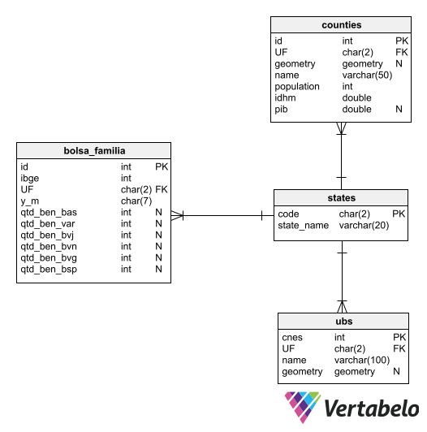

# geo_analysis

 

  
 
 

### Autores: Jonathan Santos e Marcelo Amaral

 
 
 

Este trabalho tem como objetivo geral desenvolver análises gráficas, a partir da biblioteca Geopandas do Python, e manipular dados geograficas, como GeoJSON, em um banco de dados MySQL. Para isso foram selecionados alguns datasets com dados brasileiros, com informações da população, IDHM e Pib dos municípios, além do número de Unidades Básicas de Saúde e de beneficiários do Bolsa família por localidade. Esses dados foram filtrados, editados e alocados em uma base de dados MySQL, dividida em 4 tabelas, para que fossem melhor trabalhadas posteriormente. Vale ressaltar que também foi utilizada a biblioteca Folium para construção de Mapas interativos, para melhor visualização das informações ao longo do território brasileiro.

 
 

## Datasets

 

Os dados analisados podem ser encontrados na pasta [data](https://github.com/olvrjonathan/geo_analysis/tree/main/data) deste repositório. Dentre eles, estão:

 

* 
Dados de Unidades Básicas de Saúde no Brasil e suas coordenadas [data/cadastro_estabelecimentos_cnes.csv](data/cadastro_estabelecimentos_cnes.csv). Site: https://dados.gov.br/dataset/unidades-basicas-de-saude-ubs 

* 
Dados de beneficiários do bolsa família e de suas variações de auxílio [Bolsa_familia](\data\misocial.csv). Site: https://dados.gov.br/dataset/beneficios-bolsa-familia-mi-social

* 
Dados Gerais do IBGE refente a municípios do Brasil, como população, IDHM e Pib [IBGE](\data\Cities_Brazil_IBGE.xlsx). Site: https://www.kaggle.com/gabrielrs3/economy-and-population-of-cities-in-brazil-ibge

 

Vale ressaltar que a pasta [GeoJSON](\data\geojson) possui arquivos GeoJSON com os dados geográficos dos municípios do Brasil, para que seja possível realizar as visualizações dos mapas com Geopandas. Além disso, na pasta [Climatology](\data\climatology) encontram-se alguns datasets com dados climáticos do Brasil e informações de estações meteorológicas, porém estes dados não foram utilizados nas analises finais e só estão aqui para a possibilidade de serem trabalhados posteriormente.

 
 

## Base de Dados

 

Para relacionar esses datasets em uma base de dados foi criado um modelo ER, como ilustrado abaixo, no qual foi decidido dividir 4 tabelas para os dados geográficos das cidades e estados, das unidades de saúde e dos beneficiários do bolsa família por estado. A base de dados "geo-analysis" foi criada no MySQL e os scripts de criação das tabelas estão no arquivo [script-sql](geo_analysis_create.sql). Além disso, o notebook [mysql](to_mysql.ipynb) faz a alocação e organização dos datasets na tabela.

 
 

## Análises Geográficas

 

Por fim, no notebook [exploring](exploring.ipynb) foram feitas as análises desses dados e visualizações de mapas utilizando, principalmente, as bibliotecas Geopandas e Folium. O notebook está comentado explicando melhor as analises e resultados conseyguidos.

